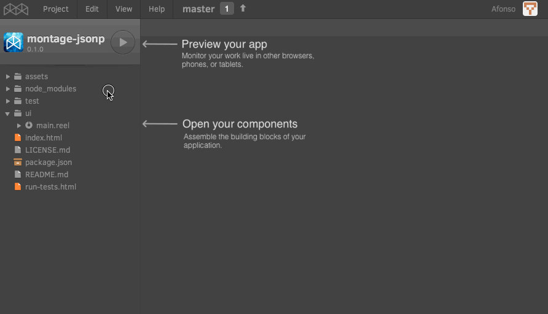
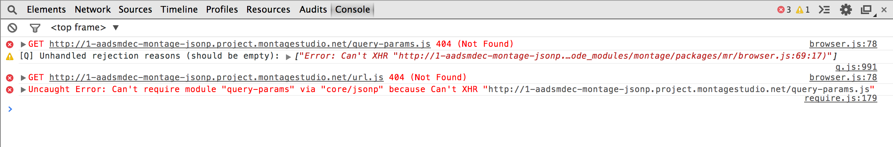
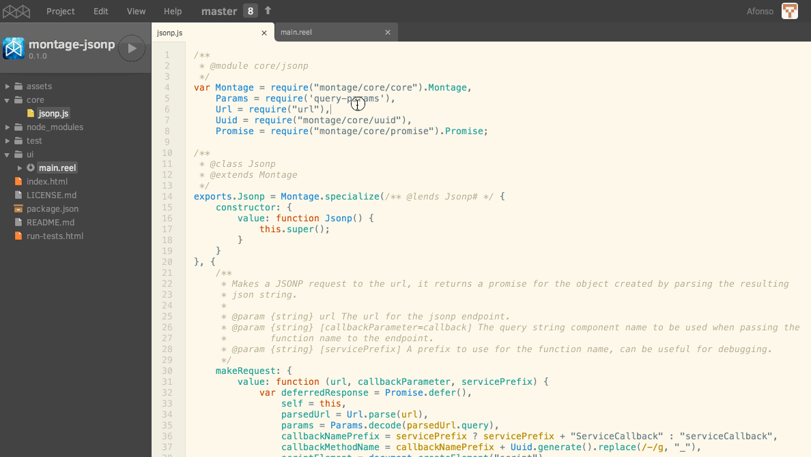
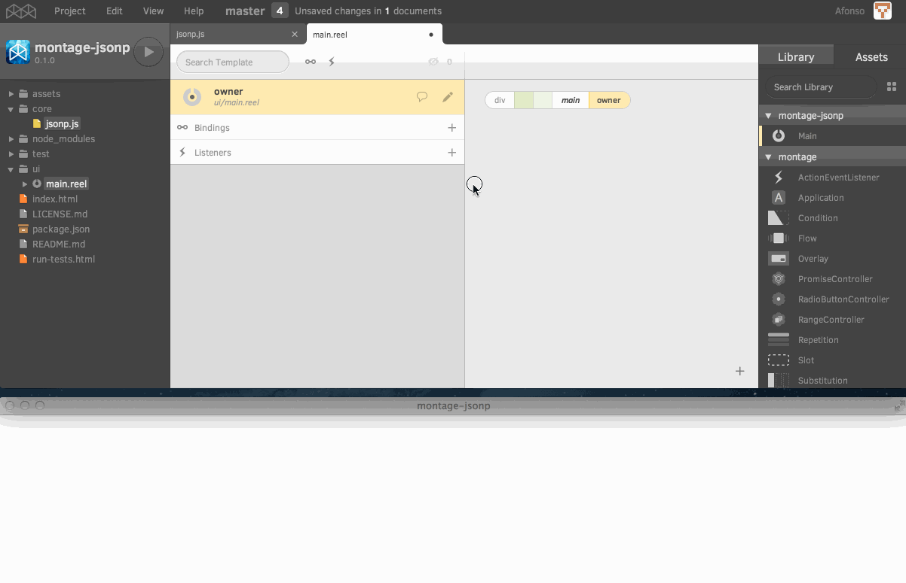
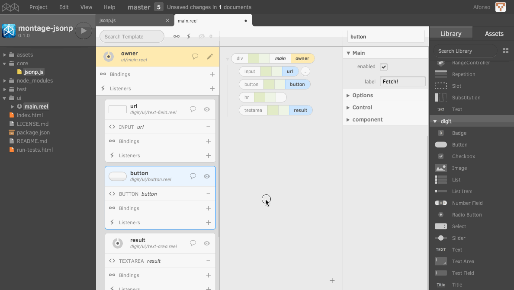
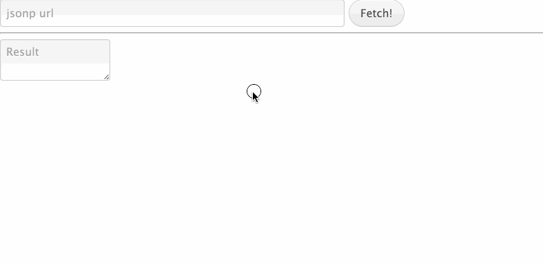

Creating an NPM package with Montage Studio
===========================================

I needed some kind of library to consume REST API data for a new application I'm developing. I know that the [Popcorn](https://github.com/montagejs/popcorn) application already has a module that does exactly this but I didn't want to copy this code once again to a different project. I figured out that the best way was just to create a package that I could reuse on all my future projects and perhaps other people's projects. Given MontageJS focus on modularity it's really simple to extract a module from an existing project and create a package that can be easily consumed by any other project.

I created an empty project that I named `montage-jsonp`. We've started using the `montage` prefix for all packages that are part of the montage ecosystem. It makes it easy to identify them and avoids name clashing on npm.

The first thing I did was to create a `core` folder and a `jsonp` module.



I then copied the contents of the file [jsonp-transport.js](https://github.com/montagejs/popcorn/blob/master/core/jsonp-transport.js) from popcorn and modified it to fit the needs of this library.

This module depends on two npm packages `query-params` and `url` and if you try to load the application in its current state the module loader will complaint about missing dependencies.



Montage Studio provides a visual npm package manager that makes dependencies easy to manage. I've used it to add the two packages.
It's as simple as searching for the two packages, adding them to the dependencies and save the changes in order to install the packages.
I've also taken the time to fill in some package information like the name and a small description of the package.
This information will be used by npm when the package is published.



With this in place we are now ready to `npm publish` the package into the npm repository.

This package can now be consumed by other MontageJS projects by searching for `montage-jsonp` in the package manager and adding it to the project.

Example with a simple application
=================================

Usualy for this kind of package - library like - there is no need for a ui/ folder with components. However, I thought that I could create an example that would allow other developers to see its intended usage, and to serve as a test bed for jsonp URLs.

For this purpose I used a TextField for the URL, a Button to make the request and a Textarea to show the response object.

One of my favourite features of Montage Studio is the live preview. It allows me to see how the application looks like while I'm developing it.
I usually have it open so I can quickly correct mistakes without the need to constantly reload the browser. You can see it at the bottom in another browser window.



The only bit of code I had to write was the button action handling function that calls `makeRequest` with the URL of the TextField and sets the response object to the Textarea when it is ready.



If you're not familiar with the MontageJS framework here's a breakdown of some of the MontageJS features used:

```javascript
handleButtonAction: {
    value: function() {
        var templateObjects = this.templateObjects;

        Jsonp.makeRequest(templateObjects.url.value)
        .then(function(response) {
            templateObjects.result.value = JSON.stringify(response, null, 2);
        });
    }
}
```

The function name `handleButtonAction` has three different components: `handle` is the prefix for all event handling; `Button` is the component label that fired the event; and `Action` is the name of the event. This event is fired when the button is pressed.

A property of the component - `templateObjects` - is also used and it is a dictionary like object that contains references to all the objects that are declared in the template. In this particular case of the `main.reel` component the available objects are: `url`, `button` and `result`.

Here's the finished application being used:



Source code: https://github.com/montagejs/montage-jsonp

NPM package: https://www.npmjs.org/package/montage-jsonp

http://creativecommons.org/licenses/by-sa/4.0/