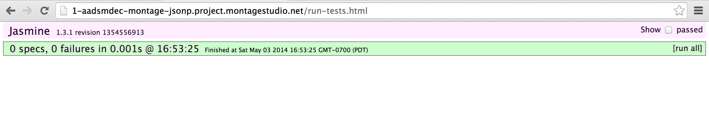
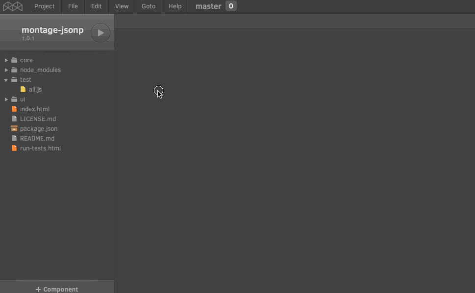
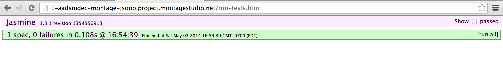

Unit Testing with Montage Studio
================================

This is a follow up to the blog post about creating an NPM package with Montage Studio.
The scaffold MontageJS application created by Montage Studio (which is supported by [minit](https://www.npmjs.org/package/minit)) creates a directory for specs and a page that runs all specs. The default testing framework is Jasmine.

You can run the tests in the preview, instead of loading the `index.html` page, load the `run-tests.html` page.



To create a unit test for montage-jsonp I created a `jsonp-spec` module in the `test` folder and added a function that tests the `makeRequest` method.

```javascript
var Jsonp = require("core/jsonp").Jsonp;

describe("jsonp-spec", function() {
    it("should get an object from a jsonp endpoint", function() {
        return Jsonp.makeRequest("http://echo.jsontest.com/key/value/one/two")
        .then(function(response) {
            expect(response).toEqual({key: "value", one: "two"})
        }).timeout(5000);
    });
});
```

I also added an entry on `all.js` for this spec, this is the file that is executed when `run-tests.html` is loaded.



Reload and the test will be executed:



MontageJS tests are supported by the [`montage-testing`](https://www.npmjs.org/package/montage-testing) package. It provides useful operations for UI testing in a MontageJS environment.

As you might have noticed by the previous code snippet `montage-testing` provides a modified version of Jasmine that is capable of dealing with promises. Since MontageJS relies heavily on promises this is an adition that greatly improves testing with Jasmine.

More on `montage-testing` on a future blog post.