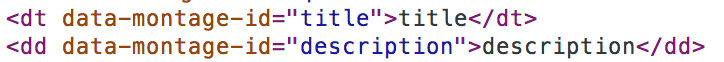
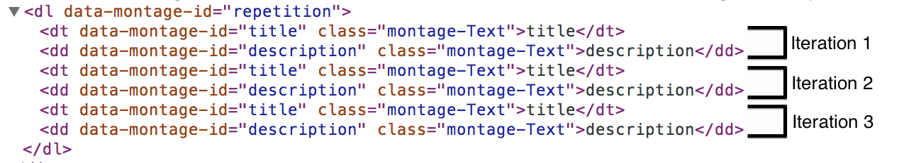
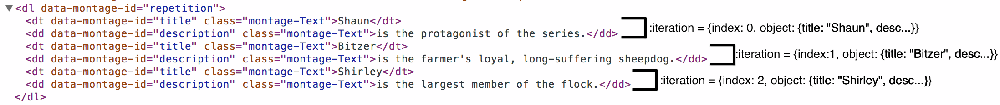

How the Repetition Works
========================

When developing for the web the repetition is probably the most used common pattern.
It allows you to repeat parts of your application using different sets of data.
In a way it is akin to the loop flow control found in programming languages, that allows you to execute the same logic using different sets of data.

Like most things in MontageJS the repetition is just another component. Due to its fundamental role it is directly provided by the framework, it can be found under the module id `montage/ui/repetition.reel`.

Given the initial description of what the repetition does, it is only logical to think that it is going to be driven by two pieces: the part of the application to repeat; and the data it should use with each repeated part.

What to repeat?
---------------

The application structure in MontageJS is fundamentally DOM based, and it relies on DOM composition to build more complex pieces of your application. If we again follow the programming language analogy it is akin to how you build more powerful functions by composing smaller (and easy to digest) functions.
This is one of the key patterns to reusability and modularity, we follow these principles very strongly when developing the MontageJS framework and applications.

The repetition just blindly repeats all its DOM contents as many times as its data allows.

The repetition is component agnostic, meaning that it can be used with any DOM element you feel like repeating its contents.

For example's sake let's just assume the repetition knows how many times it needs to repeat, we'll come back to the data part later.
Here's how to create a data definition list:
```json
"repetition": {
    "prototype": "montage/ui/repetition.reel",
    "properties": {
        "element": {"#": "repetition"}
    }
}
```
```html
<dl data-montage-id="repetition">
    <dt>Title</dt>
    <dd>Description</dd>
</dl>
```

When the repetition draws itself the resulting DOM will be:
```html
<dl data-montage-id="repetition">
    <dt>Title</dt>
    <dd>Description</dd>
    <dt>Title</dt>
    <dd>Description</dd>
    <dt>Title</dt>
    <dd>Description</dd>
    ...
</dl>
```

If the DOM contents of the repetition have components, like in the following example, they will also be repeated, just as expected.
```json
...
"title": {
    "prototype": "montage/ui/text.reel",
    "properties": {
        "element": {"#": "title"}
    }
}

"description": {
    "prototype": "montage/ui/text.reel",
    "properties": {
        "element": {"#": "description"}
    }
}
```
```html
<dl data-montage-id="repetition">
    <dt data-montage-id="title">Title</dt>
    <dd data-montage-id="description">Description</dd>
</dl>
```

In this example the repetition creates as many Text components as `dt` and `dd` elements.

Except for serving as an example this code doesn't do much for us, it is only repeating static content. In order to be useful it needs to display the data that drives the repetition.

The data driving the repetition
-------------------------------

The repetition has a property called `contentController` which accepts a `RangeController`. This object gives you a fine control over the data the repetition is consuming, and is the standard way of feeding the repetition.
However, for simplicity's sake and for the scope of this post I'm going to use the `content` property, which is intended for small examples like these.

The repetition's `content` property accepts an array of objects. The size of this array will dictate how many times the repetition will repeat its DOM contents.

### Iterations
Each item in the `content` array will correspond to an iteration of the repetition.

Usually components have a template (the `.html` file in the `.reel` directory) that is instantiated and put in the DOM. In the repetition case the template is dynamically created out of its initial DOM contents.
For each item in the `content` array the repetition instantiates this template and adds it to the DOM. This operation will create the repetition iterations.

Template of the repetition with its initial DOM contents:


Repetition iterations:


Components inside the repetition need to access the item from the `content` array that corresponds to the iteration they were created for. The repetition provides this with a template property.

Component templates are able to provide their own set of properties in order to expose objects that only exist inside the template. These properties are called template properties and are accessed through the colon (:) notation.
In the case of the repetition the template provides access to the iteration object through the `iteration` template property: `@repetition:iteration`.

The `iteration` object has two main properties:

 - `index`: the index of the iteration.
 - `object`: the corresponding item of the `content` array.

```json
"repetition": {
    "prototype": "montage/ui/repetition.reel",
    "properties": {
        "element": {"#": "repetition"},
        "content": [
            {"title": "Shaun", "description": "is the protagonist of the series."},
            {"title": "Bitzer", "description": "is the farmer's loyal, long-suffering sheepdog."},
            {"title": "Shirley", "description": "is the largest member of the flock."}
        ]
    }
},

"title": {
    "prototype": "montage/ui/text.reel",
    "properties": {
        "element": {"#": "title"}
    },
    "bindings": {
        "value": {"<-": "@repetition:iteration.object.title"}
    }
},

"description": {
    "prototype": "montage/ui/text.reel",
    "properties": {
        "element": {"#": "description"}
    },
    "bindings": {
        "value": {"<-": "@repetition:iteration.object.description"}
    }
}
...
```
```html
<dl data-montage-id="repetition">
    <dt data-montage-id="title">Title</dt>
    <dd data-montage-id="description">Description</dd>
</dl>
```

Repetition iterations using `iteration` template property.


It is important to notice that the only objects the repetition repeats are the components found inside its DOM contents. The repetition will not repeat objects that those components have references to.

Proper documentation about the Repetition can be found [here](http://docs.montagestudio.com/montagejs/repetition.html).

Repetition content used in this example was extracted from [Wikipedia](http://en.wikipedia.org/wiki/Shaun_the_Sheep).